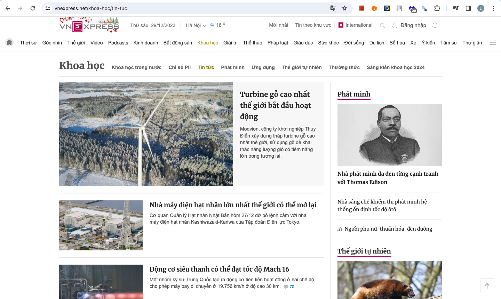

# Introduction

Word cloud is a visualization of the text data which is often used to depict keyword metadata on a websize. The important of each keyword is shown by with font size and color. Keyword with high appearance frequency will get the big font size.

In this project, i will construct word cloud from Vietnamese article crawled from [VnExpress](https://vnexpress.net/) title with R programming language.

<b>Also, there will be a step-by-step instruction on how to run the project at the end of README.md </b>

## Data

Data is crawled from [VnExpress News Article](https://vnexpress.net/khoa-hoc/tin-tuc). It contains 560 articles with more than ~1.700.000 sentences extracted from each articles.

To ensure the memory optimization and reading speed when processing this dataset. <b> Instead of storing the crawled data in CSV format the information will be stored in parquet format. </b>

<b>Limitation:</b> The crawled code can only crawl data from the predefined HTML structure which have the following page interface:



## Transform document

### Some basic transform

The data will first be converted to lower case follow by punctuation + number removal.

For the case where words aren't contained in stop word dataset but commonly appear multiple time in corpus, i apply the Tf-idf weighting function to solve this problem.

### Tokenizer

Thank you for the great work from Vietnam teams to public the vietnamese model to Spacy. For more information you can find at this repo (<https://github.com/trungtv/vi_spacy>)

The tokenizer i used is built upon the following dataset [UD-Vietnamese-VTB](https://github.com/UniversalDependencies/UD_Vietnamese-VTB) which contains 18GB of Vietnamese news.

### Stopwords removal

I use the stopwords dataset from Spacy repo. You can find it here : <https://github.com/explosion/spaCy/blob/master/spacy/lang/vi/stop_words.py>

I replace "_" in each word with " " for compatibility between tokenizer's token and stopwords

## Term-Document Matrix

Package used: tm

Package documentation: <https://cran.r-project.org/web/packages/tm/vignettes/tm.pdf>

After processing the term-document matrix will be stored in parquet format.

## Word cloud

Final result:


## How to use

### Set up conda enviroment

```
# Create conda enviroment
# Enviroment name : vietnamese_word_cloud

conda env create -f enviroment.yml

# Download vietnamese spacy model
# For latest update please refer to the following github repo: https://github.com/trungtv/vi_spacy

pip install https://gitlab.com/trungtv/vi_spacy/-/raw/master/packages/vi_core_news_lg-3.6.0/dist/vi_core_news_lg-3.6.0.tar.gz
```

### Crawl data

Help page

```
Usage: web_crawler.R [options]
Options:
    --page_url=PAGE_URL
            Page URL to crawl article from

    --num_of_pages=NUM_OF_PAGES
            Number of pages to crawl articles

    --store_path=STORE_PATH
            Path to store article contents. 
                    The content will be stored in parquet format

    -h, --help
            Show this help message and exit
```

Example

```
Rscript --vanilla  web_crawler.R --num_of_pages 1 --store_path './temp'
```

### Term-document matrix

Help page

```
Usage: term_document_matrix.R 
[options]

Options:
    --dataset_path=DATASET_PATH
            Dataset path.
                    The dataset has to be stored in parquet format.

    --store_path=STORE_PATH
            Term-document matrix store path

    -h, --help
            Show this help message and exit
```

Example

```
Rscript --vanilla term_document_matrix.R --dataset_path './news_article_contents'
```

### Word Cloud Plot

Help page

```
Usage: word_cloud.R 
[options]

Options:
    --tm_path=TM_PATH
            Term-document matrix path. 
                    Have to be stored in parquet format

    --output_path=OUTPUT_PATH
            Word cloud image output path

    -h, --help
            Show this help message and exit
```

Example

```
Rscript --vanilla word_cloud.R
```

## Reference

[1] Vietnamese Spacy Model : <https://github.com/trungtv/vi_spacy>

[2] UD-Vietanamese-VTB : <https://github.com/UniversalDependencies/UD_Vietnamese-VTB>

[3] tm package: <https://cran.r-project.org/web/packages/tm/vignettes/tm.pdf>
